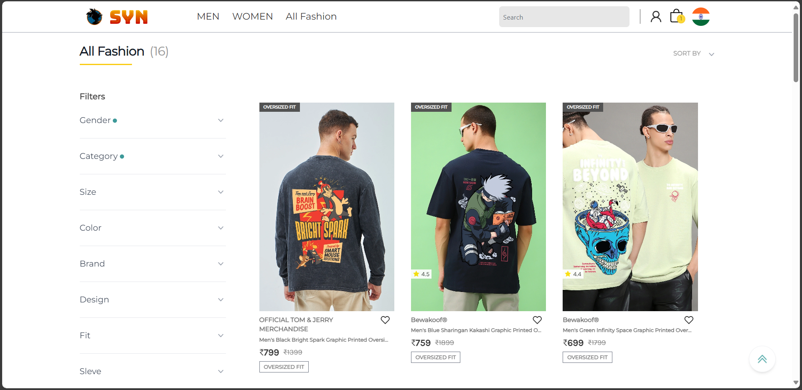

# Ecommerce Website with JWT Authentication

## Description
This project is a fully responsive ecommerce website with user authentication implemented using Passport.js. It utilizes JWT (JSON Web Tokens) for secure authentication and authorization, supporting both local authentication and JWT-based authentication. 

## Features

- **MERN Stack**: Utilizes MongoDB, Express.js, React.js, and Node.js for full-stack development.
- **Redux**: Implements Redux for state management in the frontend, enabling efficient data flow and global state management.
- **Passport.js Authentication**: Implements Passport.js strategies such as local authentication and JWT authentication for secure user authentication and authorization.
- **Stripe API Integration**: Utilizes the Stripe API for processing payments, ensuring secure and reliable payment transactions.
- **Webhooks**: Implements webhooks to receive real-time updates from Stripe, enhancing payment processing functionality.
- **Fully Responsive Design**: Offers a responsive user interface that adapts seamlessly to various screen sizes and devices.
- **Ecommerce Functionality**: Provides a comprehensive ecommerce platform with features such as product browsing, selection, cart management, admin functionality and secure checkout.

## Installation

### Prerequisites
- Node.js
- MongoDB

### Steps
1. Clone the repository.
2. Navigate to the project directory.
3. Install dependencies using `npm install`.
4. Configure environment variables for MongoDB connection, Stripe API keys, and other settings.
5. Run the frontend and backend servers using `npm start` or `npm run dev`.

## Usage

### Frontend
1. Access the frontend server using the provided URL.
2. Browse through the product catalog, add items to the cart, and proceed to checkout.
3. Complete the checkout process, providing necessary details for payment.
4. Receive real-time updates on payment status through webhooks.

### Backend
1. Access the backend server using the provided URL.
2. Utilize the implemented Passport.js strategies for user authentication and authorization.
3. Manage product data and orders stored in the MongoDB database.
4. Handle incoming payment requests and process payments using the Stripe API.

# Live URL
[Live Demo](https://supersyn.onrender.com)

## Technologies Used

- MongoDB
- Express.js
- React.js
- Node.js
- Redux
- Passport.js
- Stripe API

## Folder Structure

- `client/`: Frontend code (React.js components, Redux store, actions, and reducers).
- `server/`: Backend code (Express.js routes, controllers, and middleware).
- `models/`: MongoDB schema definitions.
- `utils/`: Utility functions and helpers.
- `config/`: Configuration files (environment variables, Passport.js settings, Stripe API keys).

## Credits

- Stripe API Documentation
- Passport.js Documentation
- React Documentation
- Node.js Documentation

## Support

For support, questions, or feedback, please contact [harshparmar87990@gmail.com](mailto:harshparmar87990@gmail.com).
